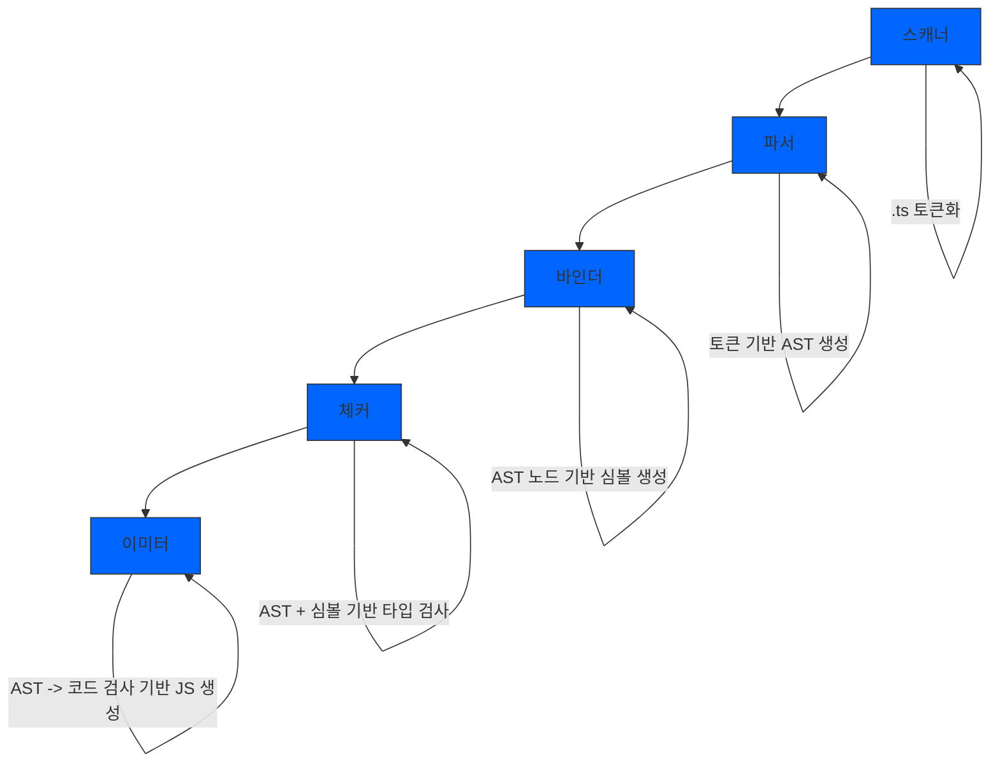

> 타입스크립트가 웹에서 실행되려면 먼저 자바스크립트로 바뀌어야 한다.
> 타입스크립트는 실제로 어떻게 컴파일할까?

## 1. 자바스크립트의 런타임과 타입스크립트의 컴파일
소스코드 --> 컴파일러 --> 기계어코드 :: 컴파일타임 --> 프로그램이 메모리에 적재되어 실행 :: 런타임


1. 소스코드: 개발자가 작성한 원본 코드.
2. 컴파일러: 소스코드를 기계어 코드로 변환하는 도구.
3. 기계어 코드: 컴파일러에 의해 생성된, 컴퓨터가 이해할 수 있는 저수준의 코드.
4. 컴파일타임: 컴파일 과정이 발생하는 시간.
5. 프로그램이 메모리에 적재되어 실행: 컴파일된 코드가 컴퓨터 메모리에 적재되고 실행되는 단계.
6. 런타임: 프로그램이 실제로 실행되고 있는 시간.

### 1-1 타입스크립트의 컴파일
타입스크립트는 `tsc`라고 불리는 컴파일러를 통해 자바스크립트 코드로 변환된다. (고수준 -> 고수준 엄밀히는 트랜스파일이라고 부르기도함)

타입스크립트 컴파일러가 소스코드를 컴파일하여 프로그램이 실행되기까지 과정

1. 타입스크립트 소스코드를 타입스크립트 AST로 만든다. (`tsc`)
2. 타입 검사기가 AST를 확인하여 타입을 확인. (`tsc`)
---- 여기까지 타입 확인 ----
3. 타입스크립트 AST를 자바스크립트 소스로 변환한다. (`tsc`)
4. 자바스크립트 소스코드를 자바스크립트 AST로 만든다. (`런타임`)
5. 자바스크립트 AST를 기계어(바이트) 코드로 변환한다. (`런타임`)
6. 런타임에서 기계어 코드가 평가되어 프로그램이 실행된다. (`런타임`)


>[!Note]
> AST(Abstract Syntax Tree) : 소스코드를 분석하고 이해하기 쉬운 구조로 변환한 것.
> 컴파일러가 소스코드를 해석하는 과정에서 생성된 데이터 구조.
> 어휘적분석과 구문 분석을 통해 소스코드를 노드 단위의 트리 구조로 구성한다.


## 2. 타입스크립트 컴파일러 구조
>[!Note] 타입스크립트는 어떻게 자바스크립트 비빔밥을 만들까? 
> 마치 package.json에서 엔트리포인트를 찾아서 비빔밥을 만들어주는 번들러와 매우 닮아있다.
> 타입스크립트 컴파일러는 어떻게 동작할까?

타입스크립트 컴파일러는 다섯 단계를 거쳐 타입 검사와 자바스크립트 소스 변환을 진행한다.



1. 스캐너(.ts 토큰화): 타입스크립트 소스 파일을 읽고, 소스 코드 문자열을 토큰으로 분해하는 과정입니다. 토큰은 컴파일러가 이해할 수 있는 최소 단위의 의미 있는 조각입니다.
2. 파서(토큰 기반 AST 생성): 토큰들을 사용하여 추상 구문 트리(AST)를 생성합니다. 이 트리는 소스 코드의 구조를 표현하며, 후속 단계에서 사용됩니다.
3. 바인더(AST 노드 기반 심볼 생성): AST를 통해 심볼을 생성하고, 스코프를 설정합니다. 심볼은 변수, 함수, 클래스 등 코드 내의 식별자에 대한 참조를 나타냅니다.
4. 체커(AST + 심볼 기반 타입 검사): 생성된 AST와 심볼 정보를 바탕으로 타입 검사를 수행합니다. 이 과정에서 타입 오류를 발견하고, 타입 정보를 확정짓습니다.
5. 이미터(AST -> 코드 검사 기반 JS 생성): 최종적으로 타입 검사를 거친 AST를 바탕으로 자바스크립트 코드를 생성합니다. 이 단계에서는 타입 정보가 제거되고, 실행 가능한 자바스크립트 코드가 출력됩니다.

### 1. 스캐너
[Typescript playground](https://www.typescriptlang.org/play?&install-plugin=playground-ts-scanner#code/PTAEHUFMBsGMHsC2lQBd5oBYoCoE8AHSAZVgCcBLA1UABWgEM8BzM+AVwDsATAGiwoBnUENANQAd0gAjQRVSQAUCEmYKsTKGYUAbpGF4OY0BoadYKdJMoL+gzAzIoz3UNEiPOofEVKVqAHSKymAAmkYI7NCuqGqcANag8ABmIjQUXrFOKBJMggBcISGgoAC0oACCbvCwDKgU8JkY7p7ehCTkVDQS2E6gnPCxGcwmZqDSTgzxxWWVoASMFmgYkAAeRJTInN3ymj4d-jSCeNsMq-wuoPaOltigAKoASgAywhK7SbGQZIIz5VWCFzSeCrZagNYbChbHaxUDcCjJZLfSDbExIAgUdxkUBIursJzCFJtXydajBRSodqgYhISD7UAAXlAAG9FCUShRuPkrqhKJxmABuNnszgMZDcwS84aFdliZiQbmcdiIaTfIUAX2CCE4WsakrEnAAoqsxQtIAA1RwUBjSdyM0AAIgAEjBoBhwPAyNEHYptYJ4O4Am7mAAKMzG03uS2UG3uACUwRUOGaHjIXkQnucwPYNC+bjMzHYDHl-Fg0HUiRt8D0Ii8DojiDNggdSWxDvADlQAHJhAA5SASB1BFQAeS+ZHegkg-HlR1QjgUrmkeFATgzOmGWH0KAQiGhwkueYknuiIgMHGxCyYrA4PCCJSAA)

**여기서 Scanner부분을 보면 분해된 토큰을 확인할 수 있다.**

히히 사진은 github에서 올려야지

### 2. 파서
스캐너가 소스 파일을 토큰으로 나눠주면 파서는 그 **토큰 정보를 이용**하여 **AST를 생성**한다.

AST는 소스 코드의 구조를 표현하는 트리 구조이며, 
최상위 노드는 타입스크립트 소스파일 / 최하위 노드는 파일의 끝 지점(EndOfFileToken)으로 구성된다. 

예를 들어 `let x = 1 + 2;` 의 AST를 그려보면 다음과 같다.
```mermaid
graph TD
    A[LetKeyword] --> B[WhitespaceTrivia]
    B --> C[Identifier]
    C --> D[WhitespaceTrivia]
    D --> E[EqualsToken]
    D --> F[WhitespaceTrivia]
    F --> G[NumericLiteral(1)]
    G --> H[PlusToken]
    H --> I[NumericLiteral(2)]
    I --> J[SemicolonToken]
    J --> K[EndOfFileToken]
```

### 3. 바인더
